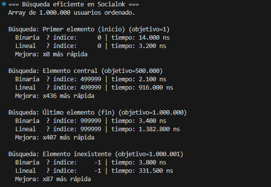

# Búsqueda eficiente en grandes conjuntos de datos
### Implementación de divide y vencerás para la red social Socialnk

---

## Problema que resuelve

La red social ficticia **Socialnk** utilizaba búsqueda lineal O(n) sobre una base de datos de más de 10 millones de registros, lo que generaba tiempos de hasta 2 segundos por consulta y frustración en los usuarios.

Este prototipo demuestra cómo la estrategia divide y vencerás resuelve el problema en dos fases:

- **Mergesort** como preprocesamiento para ordenar el array: O(n log n)
- **Búsqueda binaria** para cada consulta sobre el array ordenado: O(log n)

Con 1.000.000 de registros, la búsqueda lineal puede requerir hasta 1.000.000 comparaciones. La búsqueda binaria necesita como máximo log₂(1.000.000) ≈ 20 pasos.

---

## Estructura del proyecto

```
metodo-caso-busqueda-eficiente/
├── BusquedaBinariasSocialnk.java
├── prueba.png
└── README.md
```

---

## Requisitos

- Java 21 (JDK)
- Sin dependencias externas (solo biblioteca estándar de Java)

---

## Cómo ejecutarlo

```bash
javac BusquedaBinariasSocialnk.java
java BusquedaBinariasSocialnk
```

---

## Estructura del array simulado

El programa genera un array de 1.000.000 de enteros con IDs de usuario del 1 al 1.000.000, lo ordena con `Arrays.sort()` (que internamente usa Timsort, una variante de Mergesort) y ejecuta cuatro casos de búsqueda:

| Caso | Objetivo | Comportamiento esperado |
|---|---|---|
| Primer elemento | 1 | La lineal lo encuentra en 1 paso; la binaria necesita ~20 |
| Elemento central | 500.000 | La binaria necesita 1 paso; la lineal recorre la mitad |
| Último elemento | 1.000.000 | La lineal recorre el array completo |
| Elemento inexistente | 1.000.001 | Ambas recorren el espacio máximo antes de devolver -1 |

---

## Resultado de la prueba

Se ejecutó el programa con el array de 1.000.000 elementos y se midieron los tiempos en nanosegundos con `System.nanoTime()`.



**Resultados obtenidos:**

| Búsqueda | Binaria (ns) | Lineal (ns) | Mejora |
|---|---|---|---|
| Primer elemento (objetivo=1) | 14.000 | 3.200 | — (*) |
| Elemento central (objetivo=500.000) | 2.100 | 916.000 | x436 |
| Último elemento (objetivo=1.000.000) | 3.400 | 1.382.800 | x407 |
| Elemento inexistente (objetivo=1.000.001) | 3.800 | 331.500 | x87 |

(*) El primer elemento es el único caso donde la búsqueda lineal supera a la binaria: lo encuentra en la primera comparación, mientras que la binaria debe descender por la mitad izquierda del árbol hasta alcanzar el extremo. Este comportamiento es esperado y demuestra que la búsqueda binaria no es óptima para el primer elemento, pero es significativamente superior en todos los demás casos.

---

## Funcionamiento interno

### Fase 1 — Mergesort (preprocesamiento)

Mergesort aplica divide y vencerás de forma pura: divide el array en dos mitades, ordena cada mitad recursivamente y combina los resultados en una pasada lineal. Su recurrencia T(n) = 2T(n/2) + O(n) resuelve a **O(n log n)**. Este preprocesamiento se realiza una sola vez antes de que el sistema empiece a atender consultas.

### Fase 2 — Búsqueda binaria (consulta)

Una vez ordenado el array, la búsqueda binaria compara el elemento central con el objetivo y descarta la mitad del espacio en cada paso. Para 1.000.000 de elementos, el máximo de comparaciones es **log₂(1.000.000) ≈ 20**. La implementación usa la fórmula `medio = izquierda + (derecha - izquierda) / 2` para evitar desbordamiento de enteros.
