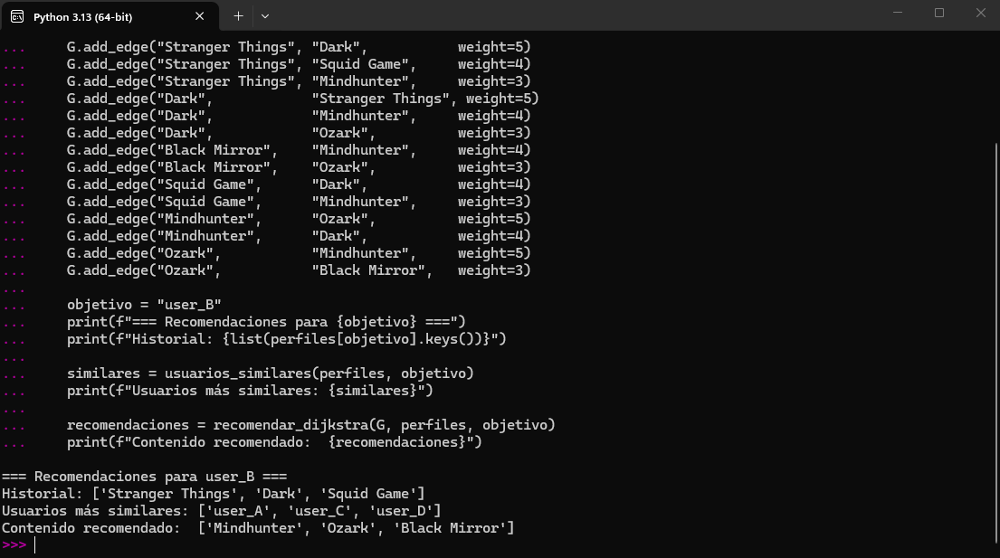
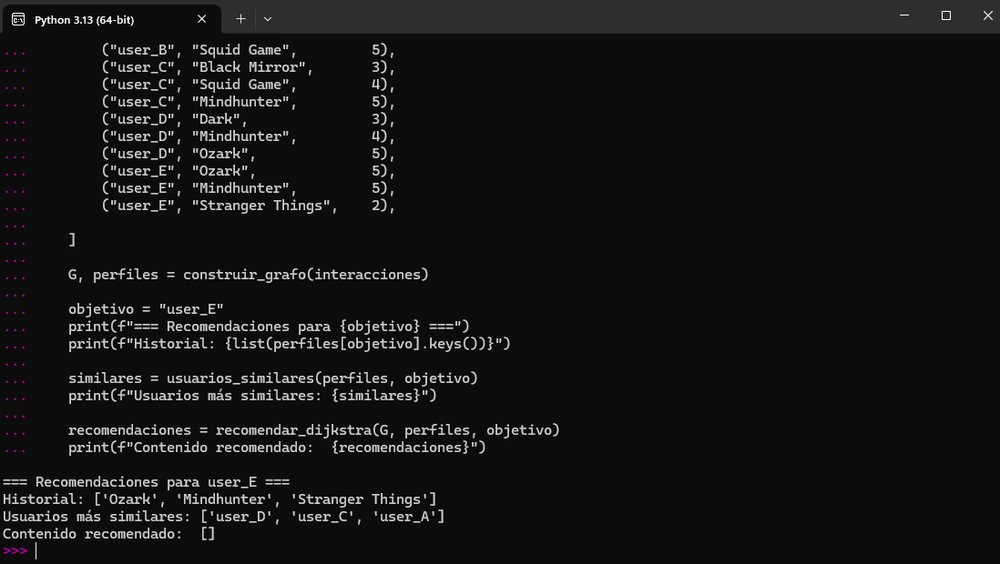
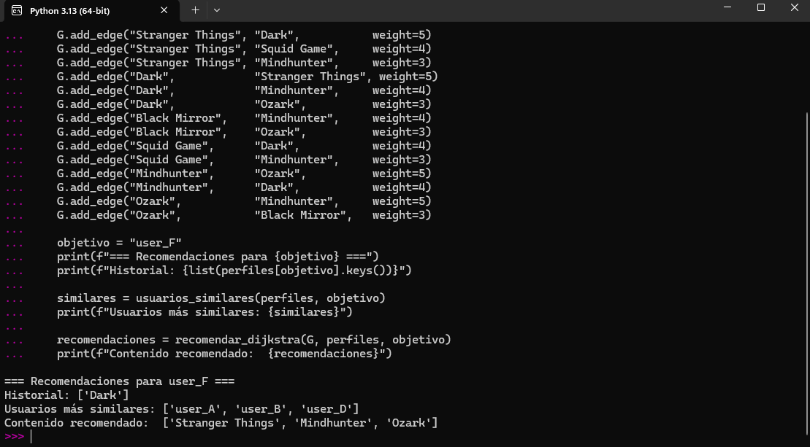

### Sistema de recomendación de contenido basado en estructuras de datos avanzadas


---

## Problema que resuelve

La plataforma ficticia **StreamX** generaba recomendaciones mediante búsquedas secuenciales sobre listas de preferencias, con una complejidad de **O(n)** que resulta inviable a gran escala.

Este prototipo sustituye ese enfoque con:

- Un **grafo dirigido ponderado** para modelar las relaciones usuario–contenido y contenido–contenido
- Una **tabla hash** (diccionario Python) para acceso en O(1) a los perfiles de usuario
- El **algoritmo de Dijkstra** con montículo mínimo para encontrar el contenido con mayor afinidad
- La **similitud del coseno** para identificar usuarios con gustos similares

---

## Estructura del proyecto

```
streamx-recommender/
├── prototipo_recomendacion.py        # código principal
├── objetivo user_A.png
├── objetivo user_B.png
├── objetivo user_E.png
├── objetivo user_F.png
└── README.md
```

---

## Requisitos

- Python 3.13
- networkx

Instalación de dependencias:

```bash
pip install networkx
```

---

## Cómo ejecutarlo

```bash
python prototipo_recomendacion.py
```

Modifica la variable `objetivo` dentro del bloque `if __name__ == '__main__':` para cambiar entre usuarios.

---

## Pruebas y resultados

Se han realizado cuatro pruebas con usuarios de distintos perfiles. El sistema recomienda contenido no visto, ordenado por afinidad calculada sobre el grafo.

---

### Prueba 1 — `user_A`

**Historial:** Stranger Things, Black Mirror, Dark  
**Usuario más similar:** user_B (comparte Stranger Things y Dark con puntuaciones altas)  
**Contenido recomendado:** Squid Game, Mindhunter y Ozark


---

### Prueba 2 — `user_B`

**Historial:** Stranger Things, Dark, Squid Game  
**Usuario más similar:** user_A  
**Contenido recomendado:** Black Mirror, Mindhunter y Ozark



---

### Prueba 3 — `user_E` *(gustos de nicho)*

**Historial:** Ozark, Mindhunter, Stranger Things (puntuación baja)  
**Usuario más similar:** user_D (comparte Ozark y Mindhunter)  
**Contenido recomendado:** Dark, Squid Game y Black Mirror



---

### Prueba 4 — `user_F` *(cold start)*

**Historial:** únicamente Dark  
**Problema detectado:** Dijkstra no encontraba aristas salientes desde los nodos de contenido y no generaba recomendaciones  
**Solución aplicada (Opción A):** se añadieron aristas contenido–contenido de forma manual (Dark → Stranger Things, Dark → Mindhunter, etc.)  
**Contenido recomendado tras la corrección:** Stranger Things, Mindhunter y Ozark



---

## Funcionamiento interno

### Estructura del grafo

```
user_A --(5)--> Stranger Things <--(5)-- user_B
user_A --(4)--> Black Mirror
user_A --(5)--> Dark --(4)--> Stranger Things   <- arista contenido-contenido (Opcion A)
                     --(3)--> Mindhunter
```

- **Nodos:** usuarios y títulos de contenido
- **Aristas dirigidas:** usuario → contenido (interacción) o contenido → contenido (similitud)
- **Peso:** puntuación de valoración (1–5). Mayor peso equivale a mayor afinidad

### Adaptación de Dijkstra

El algoritmo invierte los pesos (`1 / peso`) para que mayor afinidad equivalga a menor distancia. Partiendo de todo el historial del usuario con distancia 0, expande el grafo y ordena el contenido no visto por distancia acumulada.

### Similitud del coseno

Se utiliza para identificar usuarios con gustos similares. El cálculo opera únicamente sobre los contenidos compartidos entre dos perfiles, lo que lo hace eficiente en perfiles dispersos.

