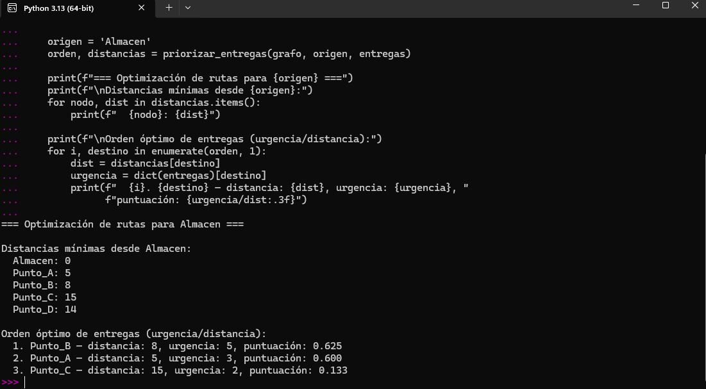
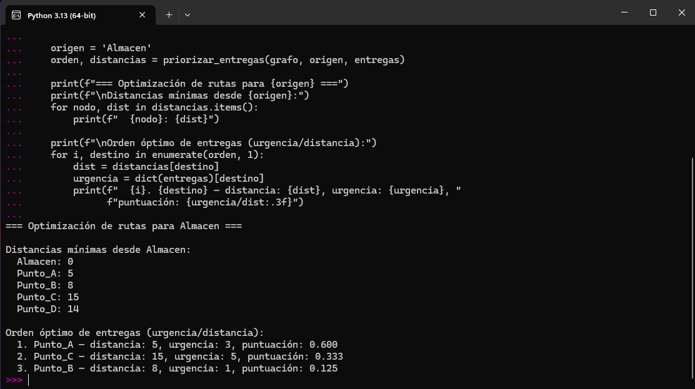
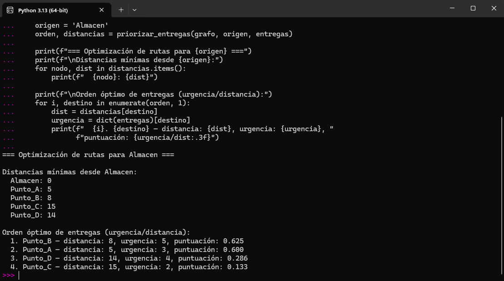

# Optimización de rutas de reparto
### Sistema de priorización de entregas basado en algoritmos voraces

---

## Problema que resuelve

La empresa ficticia **Delivery Latam** planificaba sus rutas de reparto de forma manual, sin considerar distancias ni prioridades, lo que generaba ineficiencias y retrasos.

Este prototipo resuelve el problema en dos capas:

- El **algoritmo de Dijkstra** calcula las distancias mínimas desde el almacén hacia todos los puntos de entrega del grafo
- Un **criterio voraz de priorización** ordena las entregas combinando distancia y urgencia mediante la puntuación `urgencia / distancia`

A mayor urgencia y menor distancia, mayor prioridad de atención.

---

## Estructura del proyecto

```
metodo-caso-rutas-reparto/
├── rutas_reparto.py
├──prueba1.png
├──prueba2.png
├──prueba3.png
└── README.md
```

---

## Requisitos

- Python 3.13
- Sin dependencias externas (solo módulos de la biblioteca estándar)

---

## Cómo ejecutarlo

```bash
python rutas_reparto.py
```

Para cambiar las pruebas, modifica la lista `entregas` y los niveles de urgencia dentro del bloque `if __name__ == '__main__':`.

---

## Estructura del grafo

El grafo modela una red de cinco nodos con sus distancias asociadas:

```
Almacen --(5)--> Punto_A --(3)--> Punto_B --(7)--> Punto_C
    |                                  |                 |
   (10)                               (6)               (2)
    |                                  |                 |
    +-----------> Punto_B         Punto_D <-------------+
    |
   (20)
    |
    +-----------> Punto_D
```

- **Nodos:** almacén y puntos de entrega
- **Aristas:** rutas bidireccionales con su distancia como peso
- **Urgencia:** valor del 1 (baja) al 5 (alta) asignado a cada entrega

---

## Pruebas y resultados

Se realizaron tres pruebas modificando los niveles de urgencia y el número de entregas para validar el comportamiento del criterio voraz.

---

### Prueba 1 — Configuración base

**Entregas:** Punto_A (urgencia 3), Punto_B (urgencia 5), Punto_C (urgencia 2)

**Distancias calculadas desde Almacen:** Punto_A: 5, Punto_B: 8, Punto_C: 15, Punto_D: 14

**Orden óptimo resultante:**
1. Punto_B — distancia: 8, urgencia: 5, puntuación: 0.625
2. Punto_A — distancia: 5, urgencia: 3, puntuación: 0.600
3. Punto_C — distancia: 15, urgencia: 2, puntuación: 0.133

Punto_B se antepone a Punto_A a pesar de estar más lejos, porque su urgencia (5) compensa la diferencia de distancia.



---

### Prueba 2 — Cambio de urgencias

**Entregas:** Punto_A (urgencia 3), Punto_B (urgencia 1), Punto_C (urgencia 5)

**Orden óptimo resultante:**
1. Punto_A — distancia: 5, urgencia: 3, puntuación: 0.600
2. Punto_C — distancia: 15, urgencia: 5, puntuación: 0.333
3. Punto_B — distancia: 8, urgencia: 1, puntuación: 0.125

Al reducir la urgencia de Punto_B a 1, pasa al último lugar a pesar de ser el segundo más cercano. El criterio voraz ajusta el orden automáticamente.



---

### Prueba 3 — Cuatro puntos de entrega

**Entregas:** Punto_A (urgencia 3), Punto_B (urgencia 5), Punto_C (urgencia 2), Punto_D (urgencia 4)

**Orden óptimo resultante:**
1. Punto_B — distancia: 8, urgencia: 5, puntuación: 0.625
2. Punto_A — distancia: 5, urgencia: 3, puntuación: 0.600
3. Punto_D — distancia: 14, urgencia: 4, puntuación: 0.286
4. Punto_C — distancia: 15, urgencia: 2, puntuación: 0.133

Con cuatro destinos el sistema mantiene la coherencia: Punto_D (más urgente que Punto_C pero más cercano) se atiende antes que Punto_C.



---

## Funcionamiento interno

### Dijkstra para distancias mínimas

El algoritmo parte desde el almacén con distancia 0 y expande el grafo usando un montículo mínimo (`heapq`). En cada iteración selecciona el nodo no visitado con menor distancia acumulada y actualiza los vecinos si se encuentra un camino más corto. Complejidad: **O((V + E) log V)**.

### Criterio voraz de priorización

Una vez calculadas las distancias, cada entrega recibe una puntuación `urgencia / distancia`. Las entregas se insertan en una cola de prioridad con puntuación negativa (para simular extracción del máximo con `heapq`) y se extraen en orden decreciente de prioridad.
